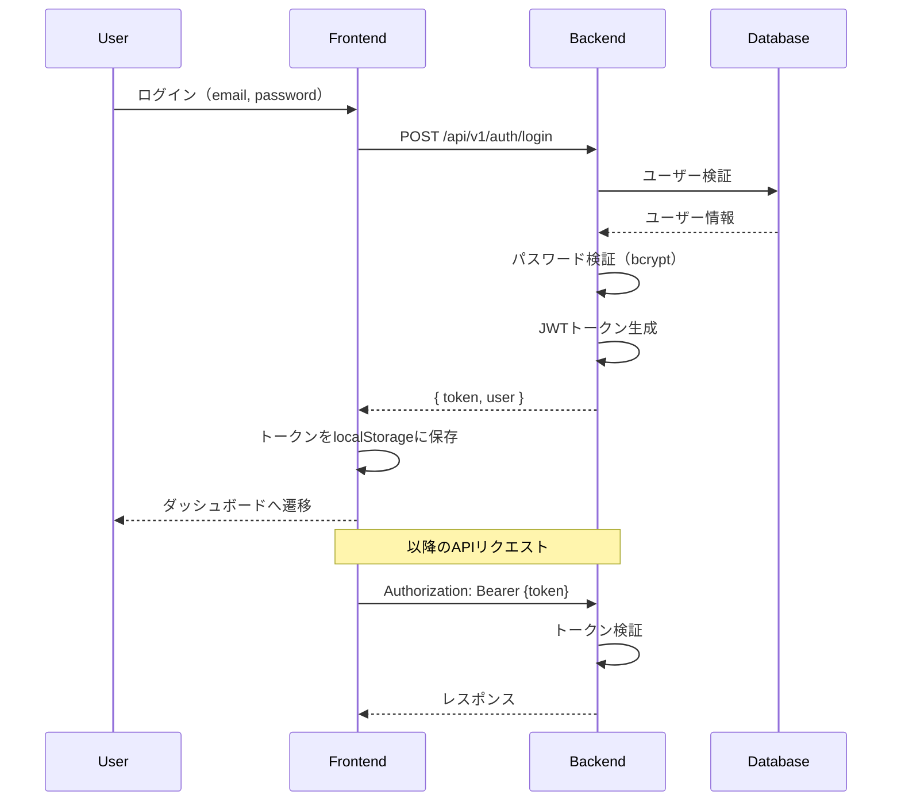
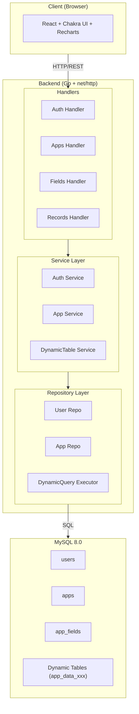
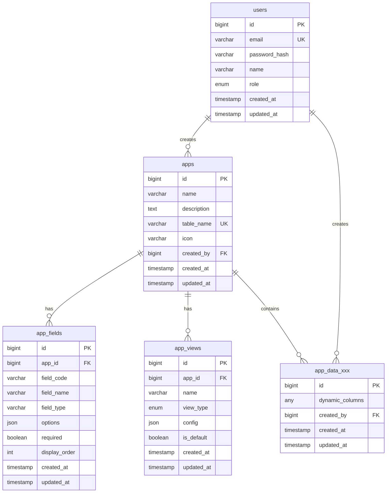
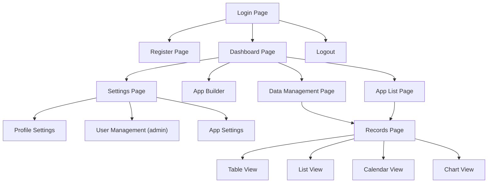

# Nocode App - 動的データベースアプリケーションプラットフォーム


動的にデータベーステーブルを作成・管理できるWebアプリケーションプラットフォーム

## 目次

1. [プロジェクト概要](#プロジェクト概要)
2. [認証と認可](#認証と認可)
3. [技術スタック](#技術スタック)
4. [システムアーキテクチャ](#システムアーキテクチャ)
5. [データベース設計](#データベース設計)
6. [API設計](#api設計)
7. [フロントエンド設計](#フロントエンド設計)
8. [セットアップ手順](#セットアップ手順)
9. [開発ガイドライン](#開発ガイドライン)
10. [テスト](#テスト)

---

## プロジェクト概要

### コンセプト

Nocode Appは、プログラミング知識なしでビジネスアプリケーションを構築できるノーコードプラットフォームです。ユーザーはGUIを通じて動的にデータベーステーブルを作成し、データの入力・表示・分析を行えます。

### 主要機能

| 機能カテゴリ | 機能詳細 |
|-------------|---------|
| **アプリ管理** | アプリ（テーブル）の作成・編集・削除、フィールド定義のドラッグ&ドロップ設計 |
| **データ管理** | レコードのCRUD操作、一覧表示、検索・フィルタリング、ソート |
| **表示モード** | テーブルビュー、リストビュー（カード形式）、カレンダービュー |
| **グラフ機能** | 棒グラフ（縦/横）、折れ線グラフ、円グラフ/ドーナツ、散布図、面グラフ |
| **認証機能** | ユーザー登録、ログイン/ログアウト、JWT認証、ロールベースアクセス制御 |

### サポートするフィールドタイプ

| タイプ | 説明 | MySQLカラム型 |
|-------|------|--------------|
| `text` | 単一行テキスト | VARCHAR(255) |
| `textarea` | 複数行テキスト | TEXT |
| `number` | 数値 | DECIMAL(18,4) |
| `date` | 日付 | DATE |
| `datetime` | 日時 | DATETIME |
| `select` | 単一選択（ドロップダウン） | VARCHAR(255) |
| `multiselect` | 複数選択 | JSON |
| `checkbox` | チェックボックス | BOOLEAN |
| `radio` | ラジオボタン | VARCHAR(255) |
| `link` | URL/メールリンク | VARCHAR(500) |
| `attachment` | ファイル添付 | JSON (メタデータ) |

---

## 認証と認可

### 認証（Authentication）

本システムはJWT（JSON Web Token）ベースの認証を採用しています。

#### 認証フロー



#### JWT トークン構造

| クレーム | 説明 |
|---------|------|
| `user_id` | ユーザーID |
| `email` | メールアドレス |
| `role` | ユーザーロール（admin/user） |
| `exp` | 有効期限（デフォルト24時間） |
| `iat` | 発行日時 |

#### セキュリティ対策

- パスワードは `bcrypt` でハッシュ化して保存
- JWTトークンは `HS256` アルゴリズムで署名
- トークンの有効期限は環境変数 `JWT_EXPIRY_HOURS` で設定可能
- APIエンドポイントは `Authorization` ヘッダーでトークンを検証

### 認可（Authorization）

本システムはロールベースアクセス制御（RBAC）を採用しています。

#### ユーザーロール

| ロール | 説明 |
|-------|------|
| `admin` | 管理者：全ての操作が可能 |
| `user` | 一般ユーザー：閲覧のみ可能 |

#### 権限マトリックス

| 操作カテゴリ | 操作 | admin | user |
|-------------|------|:-----:|:----:|
| **認証** | ログイン/ログアウト | ✅ | ✅ |
| | プロフィール編集 | ✅ | ✅ |
| | パスワード変更 | ✅ | ✅ |
| **アプリ** | アプリ一覧表示 | ✅ | ✅ |
| | アプリ詳細表示 | ✅ | ✅ |
| | アプリ作成 | ✅ | ❌ |
| | アプリ編集 | ✅ | ❌ |
| | アプリ削除 | ✅ | ❌ |
| **フィールド** | フィールド一覧表示 | ✅ | ✅ |
| | フィールド追加/編集/削除 | ✅ | ❌ |
| | フィールド順序変更 | ✅ | ❌ |
| **レコード** | レコード一覧表示 | ✅ | ✅ |
| | レコード詳細表示 | ✅ | ✅ |
| | レコード作成 | ✅ | ❌ |
| | レコード編集 | ✅ | ❌ |
| | レコード削除 | ✅ | ❌ |
| | 一括操作 | ✅ | ❌ |
| **ビュー** | ビュー一覧表示 | ✅ | ✅ |
| | ビュー作成/編集/削除 | ✅ | ❌ |
| **グラフ** | グラフデータ表示 | ✅ | ✅ |
| | グラフ設定保存/削除 | ✅ | ❌ |
| **ユーザー管理** | ユーザー一覧表示 | ✅ | ❌ |
| | ユーザー作成/編集/削除 | ✅ | ❌ |

#### 認可の実装

- **バックエンド**

```go
// RequireAdmin ミドルウェアで管理者権限をチェック
func RequireAdmin(next http.HandlerFunc) http.HandlerFunc {
    return func(w http.ResponseWriter, r *http.Request) {
        claims, ok := GetUserFromContext(r.Context())
        if !ok {
            utils.WriteErrorResponse(w, http.StatusUnauthorized, "authentication required")
            return
        }
        if claims.Role != "admin" {
            utils.WriteErrorResponse(w, http.StatusForbidden, "管理者権限が必要です")
            return
        }
        next(w, r)
    }
}
```

- **フロントエンド**

```tsx
// useAuth フックで isAdmin を提供
const { isAdmin } = useAuth();

// UI要素を条件付きでレンダリング
{isAdmin && (
  <Button onClick={handleCreate}>新規作成</Button>
)}
```

#### エラーレスポンス

| HTTPステータス | 状況 | レスポンス例 |
|--------------|------|-------------|
| 401 Unauthorized | 認証なし/トークン無効 | `{"error": "missing authorization header"}` |
| 403 Forbidden | 権限不足 | `{"error": "管理者権限が必要です"}` |

---

## 技術スタック

### バックエンド

| 技術 | バージョン | 用途 |
|-----|----------|------|
| Go | 1.24+ | メイン言語 |
| net/http | (標準) | HTTPサーバー/ルーター |
| BUN | v1 | ORM/マイグレーション |
| go-playground/validator | v10 | バリデーション |
| golang-jwt/jwt | v5 | JWT認証 |
| golang.org/x/crypto | latest | パスワードハッシュ |

### フロントエンド

| 技術 | バージョン | 用途 |
|-----|----------|------|
| React | 18+ | UIライブラリ |
| TypeScript | 5+ | 型安全性 |
| Vite | 5+ | ビルドツール |
| Chakra UI | 2+ | UIコンポーネント |
| React Router | 6+ | ルーティング |
| TanStack Query | 5+ | データフェッチング/キャッシュ |
| Recharts | 2+ | グラフ描画 |
| React DnD | 16+ | ドラッグ&ドロップ |
| Axios | 1+ | HTTPクライアント |
| Zustand | 4+ | 状態管理 |

### インフラ

| 技術 | バージョン | 用途 |
|-----|----------|------|
| Docker | 24+ | コンテナ化 |
| Docker Compose | 2+ | オーケストレーション |
| MySQL | 8.0+ | データベース |
| Nginx | latest | リバースプロキシ（本番用） |

---

## システムアーキテクチャ

### 全体構成図



### ディレクトリ構造

```shell
nocode-app/
├── README.md                    # 本ドキュメント
├── docker-compose.yaml          # Docker Compose設定
├── .env.example                 # 環境変数テンプレート
│
├── backend/
│   ├── Dockerfile
│   ├── go.mod
│   ├── go.sum
│   │
│   ├── cmd/
│   │   └── server/
│   │       └── main.go          # エントリポイント・サーバー起動
│   │
│   ├── internal/
│   │   ├── config/
│   │   │   └── config.go        # 設定管理
│   │   │
│   │   ├── middleware/
│   │   │   ├── auth.go          # JWT認証ミドルウェア
│   │   │   ├── cors.go          # CORS設定
│   │   │   └── logger.go        # ロギング
│   │   │
│   │   ├── models/
│   │   │   ├── user.go          # ユーザーモデル
│   │   │   ├── app.go           # アプリモデル
│   │   │   ├── field.go         # フィールド定義モデル
│   │   │   ├── record.go        # レコードモデル
│   │   │   └── view.go          # ビュー設定モデル
│   │   │
│   │   ├── handlers/
│   │   │   ├── auth.go          # 認証ハンドラー
│   │   │   ├── app.go           # アプリCRUD
│   │   │   ├── field.go         # フィールド管理
│   │   │   ├── record.go        # レコードCRUD
│   │   │   └── chart.go         # グラフデータ
│   │   │
│   │   ├── services/
│   │   │   ├── auth_service.go
│   │   │   ├── app_service.go
│   │   │   ├── dynamic_table_service.go  # 動的テーブル管理
│   │   │   └── chart_service.go
│   │   │
│   │   ├── repositories/
│   │   │   ├── user_repository.go
│   │   │   ├── app_repository.go
│   │   │   └── dynamic_query.go  # 動的SQLクエリビルダー
│   │   │
│   │   └── utils/
│   │       ├── jwt.go
│   │       ├── password.go
│   │       └── validator.go
│   │
│   └── migrations/
│       └── init.sql             # 初期マイグレーション
│
├── frontend/
│   ├── Dockerfile
│   ├── package.json
│   ├── tsconfig.json
│   ├── vite.config.ts
│   ├── index.html
│   │
│   ├── public/
│   │   └── favicon.ico
│   │
│   └── src/
│       ├── main.tsx             # エントリポイント
│       ├── App.tsx              # ルートコンポーネント
│       ├── vite-env.d.ts
│       │
│       ├── api/
│       │   ├── client.ts        # Axiosインスタンス
│       │   ├── auth.ts          # 認証API
│       │   ├── apps.ts          # アプリAPI
│       │   ├── records.ts       # レコードAPI
│       │   └── charts.ts        # グラフAPI
│       │
│       ├── components/
│       │   ├── common/
│       │   │   ├── Header.tsx
│       │   │   ├── Sidebar.tsx
│       │   │   ├── Loading.tsx
│       │   │   └── ErrorBoundary.tsx
│       │   │
│       │   ├── auth/
│       │   │   ├── LoginForm.tsx
│       │   │   └── RegisterForm.tsx
│       │   │
│       │   ├── apps/
│       │   │   ├── AppList.tsx
│       │   │   ├── AppCard.tsx
│       │   │   └── AppFormBuilder.tsx  # フィールド設計UI
│       │   │
│       │   ├── fields/
│       │   │   ├── FieldPalette.tsx    # ドラッグ元
│       │   │   ├── FieldDropZone.tsx   # ドロップ先
│       │   │   ├── FieldEditor.tsx     # フィールド設定
│       │   │   └── field-types/
│       │   │       ├── TextField.tsx
│       │   │       ├── NumberField.tsx
│       │   │       ├── DateField.tsx
│       │   │       ├── SelectField.tsx
│       │   │       └── ...
│       │   │
│       │   ├── records/
│       │   │   ├── RecordTable.tsx     # テーブルビュー
│       │   │   ├── RecordList.tsx      # リストビュー
│       │   │   ├── RecordForm.tsx      # 入力フォーム
│       │   │   └── RecordDetail.tsx
│       │   │
│       │   ├── views/
│       │   │   ├── ViewSelector.tsx
│       │   │   └── ViewSettings.tsx
│       │   │
│       │   └── charts/
│       │       ├── ChartBuilder.tsx    # グラフ設定UI
│       │       ├── ChartPreview.tsx
│       │       ├── BarChart.tsx
│       │       ├── LineChart.tsx
│       │       ├── PieChart.tsx
│       │       ├── ScatterChart.tsx
│       │       └── AreaChart.tsx
│       │
│       ├── hooks/
│       │   ├── useAuth.ts
│       │   ├── useApps.ts
│       │   ├── useRecords.ts
│       │   └── useCharts.ts
│       │
│       ├── pages/
│       │   ├── LoginPage.tsx
│       │   ├── RegisterPage.tsx
│       │   ├── DashboardPage.tsx
│       │   ├── AppListPage.tsx
│       │   ├── AppBuilderPage.tsx
│       │   ├── RecordsPage.tsx
│       │   └── ChartPage.tsx
│       │
│       ├── stores/
│       │   ├── authStore.ts
│       │   └── appStore.ts
│       │
│       ├── types/
│       │   ├── auth.ts
│       │   ├── app.ts
│       │   ├── field.ts
│       │   ├── record.ts
│       │   └── chart.ts
│       │
│       ├── utils/
│       │   ├── constants.ts
│       │   └── helpers.ts
│       │
│       └── theme/
│           └── index.ts         # Chakra UIテーマ
│
└── nginx/
    └── nginx.conf               # 本番用Nginx設定
```

---

## データベース設計

### ER図



### テーブル定義

#### users テーブル

| カラム名 | 型 | 制約 | 説明 |
|---------|-----|------|------|
| id | BIGINT UNSIGNED | PK, AUTO_INCREMENT | 主キー |
| email | VARCHAR(255) | UNIQUE, NOT NULL | メールアドレス |
| password_hash | VARCHAR(255) | NOT NULL | bcryptハッシュ |
| name | VARCHAR(100) | NOT NULL | 表示名 |
| role | ENUM('admin','user') | DEFAULT 'user' | ロール |
| created_at | TIMESTAMP | DEFAULT CURRENT_TIMESTAMP | 作成日時 |
| updated_at | TIMESTAMP | ON UPDATE CURRENT_TIMESTAMP | 更新日時 |

#### apps テーブル

| カラム名 | 型 | 制約 | 説明 |
|---------|-----|------|------|
| id | BIGINT UNSIGNED | PK, AUTO_INCREMENT | 主キー |
| name | VARCHAR(100) | NOT NULL | アプリ名 |
| description | TEXT | | 説明 |
| table_name | VARCHAR(64) | UNIQUE, NOT NULL | 動的テーブル名（app_data_xxx形式） |
| icon | VARCHAR(50) | DEFAULT 'default' | アイコン識別子 |
| created_by | BIGINT UNSIGNED | FK → users.id | 作成者 |
| created_at | TIMESTAMP | | 作成日時 |
| updated_at | TIMESTAMP | | 更新日時 |

#### app_fields テーブル

| カラム名 | 型 | 制約 | 説明 |
|---------|-----|------|------|
| id | BIGINT UNSIGNED | PK, AUTO_INCREMENT | 主キー |
| app_id | BIGINT UNSIGNED | FK → apps.id, NOT NULL | 所属アプリ |
| field_code | VARCHAR(64) | NOT NULL | フィールドコード（カラム名として使用） |
| field_name | VARCHAR(100) | NOT NULL | 表示名 |
| field_type | VARCHAR(20) | NOT NULL | フィールドタイプ |
| options | JSON | | 選択肢・設定等 |
| required | BOOLEAN | DEFAULT FALSE | 必須フラグ |
| display_order | INT | DEFAULT 0 | 表示順序 |
| created_at | TIMESTAMP | | 作成日時 |
| updated_at | TIMESTAMP | | 更新日時 |

#### app_views テーブル

| カラム名 | 型 | 制約 | 説明 |
|---------|-----|------|------|
| id | BIGINT UNSIGNED | PK, AUTO_INCREMENT | 主キー |
| app_id | BIGINT UNSIGNED | FK → apps.id | 所属アプリ |
| name | VARCHAR(100) | NOT NULL | ビュー名 |
| view_type | ENUM('table','list','calendar','chart') | NOT NULL | ビュータイプ |
| config | JSON | | ビュー設定（カラム表示、ソート、フィルタ等） |
| is_default | BOOLEAN | DEFAULT FALSE | デフォルトビューフラグ |
| created_at | TIMESTAMP | | 作成日時 |
| updated_at | TIMESTAMP | | 更新日時 |

#### app_data_xxx（動的テーブル）

アプリ作成時に動的に生成されるテーブル。命名規則: `app_data_{app_id}`

| カラム名 | 型 | 制約 | 説明 |
|---------|-----|------|------|
| id | BIGINT UNSIGNED | PK, AUTO_INCREMENT | レコードID |
| {field_code} | 各フィールドタイプに対応 | | 動的カラム |
| created_by | BIGINT UNSIGNED | FK → users.id | 作成者 |
| created_at | TIMESTAMP | | 作成日時 |
| updated_at | TIMESTAMP | | 更新日時 |

---

## API設計

### 認証API

| メソッド | エンドポイント | 説明 |
|---------|---------------|------|
| POST | `/api/v1/auth/register` | ユーザー登録 |
| POST | `/api/v1/auth/login` | ログイン（JWT発行） |
| POST | `/api/v1/auth/refresh` | トークンリフレッシュ |
| GET | `/api/v1/auth/me` | 現在のユーザー情報取得 |
| PUT | `/api/v1/auth/profile` | 自分のプロフィール更新（名前） |
| PUT | `/api/v1/auth/password` | パスワード変更 |

### ユーザー管理API（admin専用）

| メソッド | エンドポイント | 説明 |
|---------|---------------|------|
| GET | `/api/v1/users` | ユーザー一覧取得 |
| POST | `/api/v1/users` | ユーザー作成（招待） |
| GET | `/api/v1/users/:id` | ユーザー詳細取得 |
| PUT | `/api/v1/users/:id` | ユーザー更新（名前、ロール） |
| DELETE | `/api/v1/users/:id` | ユーザー削除 |

### アプリAPI

| メソッド | エンドポイント | 説明 |
|---------|---------------|------|
| GET | `/api/v1/apps` | アプリ一覧取得 |
| POST | `/api/v1/apps` | アプリ作成（テーブル生成含む） |
| GET | `/api/v1/apps/:id` | アプリ詳細取得 |
| PUT | `/api/v1/apps/:id` | アプリ更新 |
| DELETE | `/api/v1/apps/:id` | アプリ削除（テーブル削除含む） |

### フィールドAPI

| メソッド | エンドポイント | 説明 |
|---------|---------------|------|
| GET | `/api/v1/apps/:appId/fields` | フィールド一覧取得 |
| POST | `/api/v1/apps/:appId/fields` | フィールド追加（ALTER TABLE） |
| PUT | `/api/v1/apps/:appId/fields/:id` | フィールド更新 |
| DELETE | `/api/v1/apps/:appId/fields/:id` | フィールド削除（ALTER TABLE） |
| PUT | `/api/v1/apps/:appId/fields/order` | フィールド順序更新 |

### レコードAPI

| メソッド | エンドポイント | 説明 |
|---------|---------------|------|
| GET | `/api/v1/apps/:appId/records` | レコード一覧取得（ページネーション、フィルタ、ソート対応） |
| POST | `/api/v1/apps/:appId/records` | レコード作成 |
| GET | `/api/v1/apps/:appId/records/:id` | レコード詳細取得 |
| PUT | `/api/v1/apps/:appId/records/:id` | レコード更新 |
| DELETE | `/api/v1/apps/:appId/records/:id` | レコード削除 |
| POST | `/api/v1/apps/:appId/records/bulk` | 一括登録 |
| DELETE | `/api/v1/apps/:appId/records/bulk` | 一括削除 |

### ビューAPI

| メソッド | エンドポイント | 説明 |
|---------|---------------|------|
| GET | `/api/v1/apps/:appId/views` | ビュー一覧取得 |
| POST | `/api/v1/apps/:appId/views` | ビュー作成 |
| PUT | `/api/v1/apps/:appId/views/:id` | ビュー更新 |
| DELETE | `/api/v1/apps/:appId/views/:id` | ビュー削除 |

### グラフAPI

| メソッド | エンドポイント | 説明 |
|---------|---------------|------|
| POST | `/api/v1/apps/:appId/charts/data` | グラフ用データ取得（集計処理） |
| GET | `/api/v1/apps/:appId/charts/config` | 保存済みグラフ設定一覧 |
| POST | `/api/v1/apps/:appId/charts/config` | グラフ設定保存 |

### リクエスト/レスポンス例

#### プロフィール更新

```json
// PUT /api/v1/auth/profile
// Request
{
  "name": "新しい名前"
}

// Response
{
  "id": 1,
  "email": "user@example.com",
  "name": "新しい名前",
  "role": "user",
  "created_at": "2025-01-01T00:00:00Z",
  "updated_at": "2025-01-01T00:00:00Z"
}
```

#### パスワード変更

```json
// PUT /api/v1/auth/password
// Request
{
  "current_password": "oldpassword",
  "new_password": "newpassword123"
}

// Response
{
  "message": "パスワードを変更しました"
}
```

#### ユーザー一覧取得（admin専用）

```json
// GET /api/v1/users?page=1&limit=20
// Response
{
  "users": [
    {
      "id": 1,
      "email": "admin@example.com",
      "name": "管理者",
      "role": "admin",
      "created_at": "2025-01-01T00:00:00Z",
      "updated_at": "2025-01-01T00:00:00Z"
    },
    {
      "id": 2,
      "email": "user@example.com",
      "name": "一般ユーザー",
      "role": "user",
      "created_at": "2025-01-01T00:00:00Z",
      "updated_at": "2025-01-01T00:00:00Z"
    }
  ],
  "pagination": {
    "page": 1,
    "limit": 20,
    "total": 2,
    "total_pages": 1
  }
}
```

#### ユーザー作成（admin専用）

```json
// POST /api/v1/users
// Request
{
  "email": "newuser@example.com",
  "password": "password123",
  "name": "新規ユーザー",
  "role": "user"
}

// Response
{
  "id": 3,
  "email": "newuser@example.com",
  "name": "新規ユーザー",
  "role": "user",
  "created_at": "2025-01-01T00:00:00Z",
  "updated_at": "2025-01-01T00:00:00Z"
}
```

#### ユーザー更新（admin専用）

```json
// PUT /api/v1/users/2
// Request
{
  "name": "更新された名前",
  "role": "admin"
}

// Response
{
  "id": 2,
  "email": "user@example.com",
  "name": "更新された名前",
  "role": "admin",
  "created_at": "2025-01-01T00:00:00Z",
  "updated_at": "2025-01-01T00:00:00Z"
}
```

#### アプリ作成

```json
// POST /api/v1/apps
// Request
{
  "name": "顧客管理",
  "description": "顧客情報を管理するアプリ",
  "icon": "users",
  "fields": [
    {
      "field_code": "customer_name",
      "field_name": "顧客名",
      "field_type": "text",
      "required": true,
      "display_order": 1
    },
    {
      "field_code": "email",
      "field_name": "メールアドレス",
      "field_type": "link",
      "options": { "link_type": "email" },
      "required": true,
      "display_order": 2
    },
    {
      "field_code": "status",
      "field_name": "ステータス",
      "field_type": "select",
      "options": {
        "choices": ["見込み", "商談中", "成約", "失注"]
      },
      "display_order": 3
    }
  ]
}

// Response
{
  "id": 1,
  "name": "顧客管理",
  "description": "顧客情報を管理するアプリ",
  "table_name": "app_data_1",
  "icon": "users",
  "fields": [...],
  "created_at": "2025-01-01T00:00:00Z",
  "updated_at": "2025-01-01T00:00:00Z"
}
```

#### レコード取得（フィルタ・ソート付き）

```json
// GET /api/v1/apps/1/records?page=1&limit=20&sort=created_at:desc&filter=status:eq:商談中
// Response
{
  "records": [
    {
      "id": 1,
      "customer_name": "株式会社ABC",
      "email": "contact@abc.co.jp",
      "status": "商談中",
      "created_by": 1,
      "created_at": "2025-01-01T00:00:00Z",
      "updated_at": "2025-01-01T00:00:00Z"
    }
  ],
  "pagination": {
    "page": 1,
    "limit": 20,
    "total": 150,
    "total_pages": 8
  }
}
```

#### グラフデータ取得

```json
// POST /api/v1/apps/1/charts/data
// Request
{
  "chart_type": "bar",
  "x_axis": {
    "field": "status",
    "label": "ステータス"
  },
  "y_axis": {
    "aggregation": "count",
    "label": "件数"
  },
  "filters": []
}

// Response
{
  "labels": ["見込み", "商談中", "成約", "失注"],
  "datasets": [
    {
      "label": "件数",
      "data": [45, 30, 60, 15]
    }
  ]
}
```

---

## フロントエンド設計

### 画面遷移図



### 主要コンポーネント設計

#### AppFormBuilder（フィールド設計UI）

```text
┌──────────────────────────────────────────────────────────────┐
│  アプリ設定: 顧客管理                              [保存] [×] │
├──────────────────────────────────────────────────────────────┤
│ ┌─────────────┐  ┌─────────────────────────────────────────┐ │
│ │ フィールド   │  │          フォームプレビュー             │ │
│ │ パレット    │  │  ┌─────────────────────────────────┐   │ │
│ │             │  │  │ ╔═══════════════════════════╗   │   │ │
│ │ [テキスト]  │  │  │ ║ 顧客名 *                  ║   │   │ │
│ │ [数値]      │  │  │ ╚═══════════════════════════╝   │   │ │
│ │ [日付]      │  │  │ ┌───────────────────────────┐   │   │ │
│ │ [選択]      │  │  │ │ メールアドレス *          │   │   │ │
│ │ [複数選択]  │  │  │ └───────────────────────────┘   │   │ │
│ │ [チェック]  │  │  │ ┌───────────────────────────┐   │   │ │
│ │ [添付]      │  │  │ │ ステータス ▼              │   │   │ │
│ │ ...         │  │  │ └───────────────────────────┘   │   │ │
│ │             │  │  │                                 │   │ │
│ │ ←ドラッグ   │  │  │ ここにドロップ                 │   │ │
│ └─────────────┘  └─────────────────────────────────────────┘ │
│                  ┌─────────────────────────────────────────┐ │
│                  │ フィールド設定                          │ │
│                  │ 名前: [顧客名        ]                  │ │
│                  │ コード: [customer_name]                 │ │
│                  │ 必須: [✓]                               │ │
│                  └─────────────────────────────────────────┘ │
└──────────────────────────────────────────────────────────────┘
```

#### RecordTable（テーブルビュー）

```text
┌──────────────────────────────────────────────────────────────┐
│  顧客管理                                        [+ 追加]    │
├──────────────────────────────────────────────────────────────┤
│ ビュー: [テーブル ▼] [リスト] [グラフ]     検索: [________] │
├──────────────────────────────────────────────────────────────┤
│ □ │ ID │ 顧客名 ▲      │ メール          │ ステータス │ ... │
├───┼────┼───────────────┼─────────────────┼────────────┼─────┤
│ □ │ 1  │ 株式会社ABC   │ abc@example.com │ 商談中     │ ... │
│ □ │ 2  │ 株式会社XYZ   │ xyz@example.com │ 成約       │ ... │
│ □ │ 3  │ DEF商事       │ def@example.com │ 見込み     │ ... │
├───┴────┴───────────────┴─────────────────┴────────────┴─────┤
│ [選択削除]                    < 1 2 3 ... 8 >   20件/ページ  │
└──────────────────────────────────────────────────────────────┘
```

#### ChartBuilder（グラフ設定UI）

```text
┌──────────────────────────────────────────────────────────────┐
│  グラフ作成                                         [保存]   │
├──────────────────────────────────────────────────────────────┤
│ ┌─────────────────────┐  ┌─────────────────────────────────┐ │
│ │ グラフ種類          │  │                                 │ │
│ │ (●) 棒グラフ        │  │        ████                     │ │
│ │ ( ) 横棒グラフ      │  │   ████ ████                     │ │
│ │ ( ) 折れ線グラフ    │  │   ████ ████ ████                │ │
│ │ ( ) 円グラフ        │  │   ████ ████ ████ ████           │ │
│ │ ( ) ドーナツ        │  │   ──────────────────            │ │
│ │ ( ) 散布図          │  │   見込 商談 成約 失注            │ │
│ │ ( ) 面グラフ        │  │                                 │ │
│ ├─────────────────────┤  │      プレビュー                 │ │
│ │ X軸                 │  │                                 │ │
│ │ フィールド: [ステータス ▼]                               │ │
│ ├─────────────────────┤  │                                 │ │
│ │ Y軸                 │  │                                 │ │
│ │ 集計: [件数 ▼]      │  │                                 │ │
│ │ フィールド: [-- ▼]  │  └─────────────────────────────────┘ │
│ └─────────────────────┘                                      │
└──────────────────────────────────────────────────────────────┘
```

---

## セットアップ手順

### 前提条件

- Docker Desktop 4.0以上
- Docker Compose 2.0以上
- Node.js 20以上（ローカル開発時）
- Go 1.22以上（ローカル開発時）

### Docker Composeによる起動

```bash
# リポジトリのクローン
cd nocode-app

# 環境変数ファイルの作成
cp .env.example .env
# .envを編集して必要な値を設定

# コンテナのビルドと起動
docker compose up -d --build

# ログの確認
docker compose logs -f

# 停止
docker compose down

# ボリュームも含めて削除
docker compose down -v
```

### 環境変数

```bash
# .env.example
# MySQL
MYSQL_ROOT_PASSWORD=rootpassword
MYSQL_DATABASE=nocode-app
MYSQL_USER=nocode
MYSQL_PASSWORD=nocodepassword

# Backend
DB_HOST=mysql
DB_PORT=3306
DB_USER=nocode
DB_PASSWORD=nocodepassword
DB_NAME=nocode-app
JWT_SECRET=your-super-secret-jwt-key-change-in-production
JWT_EXPIRY_HOURS=24

# Frontend
VITE_API_URL=http://localhost:8080/api/v1
```

### アクセスURL

| サービス | URL |
|---------|-----|
| フロントエンド | <http://localhost:3000> |
| バックエンドAPI | <http://localhost:8080/api/v1> |
| MySQL | localhost:3306 |

---

## 開発ガイドライン

### コーディング規約

#### Go

- [Effective Go](https://go.dev/doc/effective_go) に準拠
- パッケージ名は小文字単数形
- エラーは必ずハンドリング
- コメントはGoDoc形式で記述

#### TypeScript/React

- ESLint + Prettier による自動フォーマット
- コンポーネントは関数コンポーネント + Hooks
- 型定義は types/ ディレクトリに集約
- カスタムフックは use プレフィックス

### Git運用

- main: 本番リリース用
- develop: 開発統合ブランチ
- feature/xxx: 機能開発
- fix/xxx: バグ修正

コミットメッセージは Conventional Commits 形式:

```text
feat: アプリ作成機能を追加
fix: レコード削除時のエラーを修正
docs: README更新
refactor: ハンドラーの共通処理を抽出
```

---

## テスト

### バックエンドテスト

```bash
cd backend

# 全テスト実行（lint含む）
./lint.sh

# ユニットテストのみ
go test ./...

# カバレッジ付き
go test -coverprofile=coverage.out ./...
go tool cover -html=coverage.out
```

### フロントエンドテスト

```bash
cd frontend

# ユニットテスト
pnpm test

# カバレッジ付き
pnpm test -- --coverage

# lint + typecheck
pnpm check
```

### E2Eテスト（Playwright）

```bash
cd e2e

# 依存関係インストール
pnpm install
pnpm exec playwright install

# テスト実行（ヘッドレス）
pnpm test

# UIモードで実行
pnpm test:ui

# 特定のテストファイルのみ
pnpm test tests/auth.spec.ts

# レポート表示
pnpm exec playwright show-report
```

#### E2Eテストの前提条件

- Docker Composeでアプリケーションが起動していること
- `http://localhost:3000` でフロントエンドにアクセス可能
- `http://localhost:8080` でバックエンドAPIにアクセス可能

#### E2Eテストの構成

| テストファイル | テスト内容 |
|--------------|----------|
| `auth.spec.ts` | ユーザー登録、ログイン、ログアウト |
| `apps.spec.ts` | アプリ作成、編集、削除 |
| `records.spec.ts` | レコードのCRUD、ビュー切替 |
| `settings.spec.ts` | プロフィール、パスワード変更、ユーザー管理 |
| `authorization.spec.ts` | ロールベースアクセス制御の検証 |

#### 冪等性の保証

E2Eテストは冪等性を保証するため、以下の戦略を採用しています：

1. **テストごとの独立したデータ**: 各テストはタイムスタンプ付きのユニークなデータを作成
2. **テスト後のクリーンアップ**: 作成したリソースはテスト終了時に削除
3. **順序非依存**: テストは任意の順序で実行可能

---

## ライセンス

MIT License
